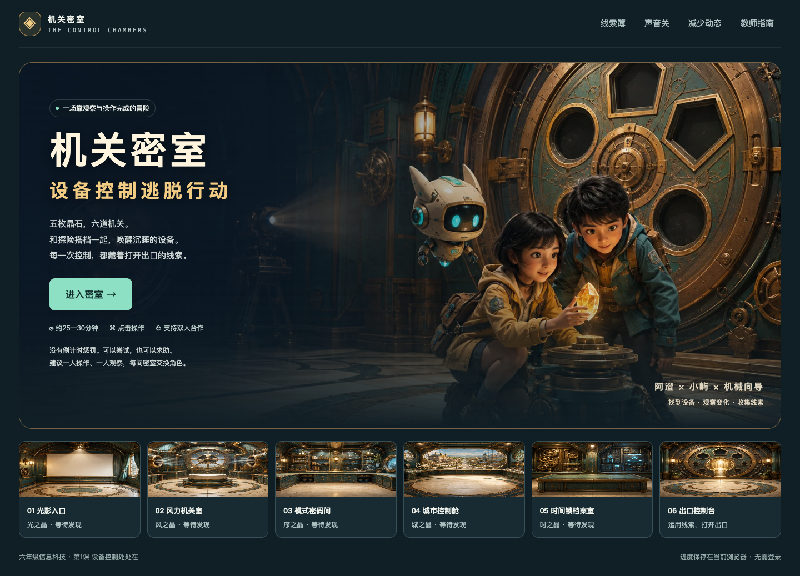

# 机关密室 · 设备控制逃脱行动

面向六年级《第1课 设备控制处处在》的轻量交互游戏与配套课堂活动。学生通过控制设备、观察变化、收集晶石线索、解释发现，完成六间密室。前三枚晶石的刻字构成时间锁密码；通关后还能设计同伴机关并验证改进。



## 直接使用

下载仓库（Code → Download ZIP）并解压，用浏览器打开 **index.html**。单文件约1.2 MB，已内嵌全部网页美术与程序，支持离线运行，无需登录或安装依赖。

## 教室局域网

教师电脑需 Python 3，学生端只需浏览器。

- macOS：双击 **启动局域网.command**。
- Windows：双击 **启动局域网-Windows.bat**。
- 也可进入项目目录运行：`python3 启动服务.py`（Windows可用 `py -3 启动服务.py`）。

启动窗口显示教师电脑的局域网地址，例如 `http://192.168.1.100:8765`。学生与教师连接同一可互访网络，通过实际显示的地址进入。保持服务窗口开启；按 Control+C 停止。端口被占用时可加 `--port 8766`。

仓库地址用于保存和下载项目，不是在线游戏地址。详细操作见 [使用说明](先读我—使用说明.md)。

## 学生会做什么

| 区域 | 操作与学习 |
|---|---|
| 光影入口 | 控制照明、投影与播放器，观察功能及环境变化 |
| 风力机关室 | 调整风速、设置定时，观察叶轮、羽片与停机 |
| 模式密码间 | 区分开启电源与选择快洗、脱水、煮粥等功能 |
| 城市控制舱 | 认识驾驶员、交通管理部门、城市管理部门控制的设备 |
| 时间锁档案室 | 收集密码线索，比较机械钥匙与电子密码控制方式 |
| 出口控制台 | 将控制方法迁移到新任务，开启出口 |

18个操作任务、6个解释检查、三级提示、控制线索簿、终局任务单考核、报告导出、同伴机关设计。终局考核对应纸笔任务单中的设备—功能—控制方法、街道设备、观察调整、设备发展和迁移表达；学生通过点击选项和拼句完成，不要求长篇打字。以25—30分钟主线探究为设计目标，实际体验时长和学习成效仍需通过真实课堂试用验证。

## 教学资料

- [学习活动设计—教师版.docx](学习活动设计—教师版.docx) / [PDF](学习活动设计—教师版.pdf)：6页，含目标依据、项目活动、跨学科联系、流程、评价与支架。
- [探险任务单—学生版.docx](探险任务单—学生版.docx) / [PDF](探险任务单—学生版.pdf)：2页，含设备控制记录、发展比较、自创机关与互评。

目标对齐用户提供的教材第11—14页与2022年版课标第三学段“过程与控制”“小型系统模拟”。本仓库不包含教材、课标原PDF。游戏中风力机关与定时快进为模拟；真实设备面板依型号而异。

## 学习记录

进度保存在各自浏览器，离线文件与不同服务器地址之间不会同步。线索簿可导出可打印HTML报告，包含预测、尝试、解释、迁移表达与同伴验证。教师端不集中收集数据；学生通过学校既有渠道提交报告。

## 开发与验证

学生使用游戏不需要Node。只有修改源码、重新生成文档或运行测试时才需要以下环境。

```sh
npm install
npm test
npm run build
npx playwright install chromium
npm run test:e2e
npm run docs
```

已安装Chrome时可设置 `PLAYWRIGHT_CHANNEL=chrome` 运行浏览器测试。测试截图及中间文件被Git忽略；验证范围见 [验证说明](开发与验证/验证说明.md)。

文档生成使用本机中文字体。PDF转换需LibreOffice，并确保转换环境能找到中文字体；文档必须转换后检查中文显示、分页和表格。

界面使用标准HTML、CSS、JavaScript与内嵌SVG，无CDN或在线AI调用。原始美术、网页用WebP及生图提示词保存在 [美术素材](美术素材/)。素材由内置image_gen生成；工具未公开模型名称，未声称指定为image2。
